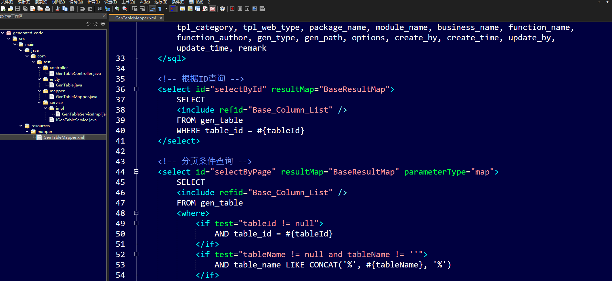

# CRUD代码生成器

## 功能简介
可根据数据库表结构自动生成crud（增删改查）代码，具体包括：
1. 实体类
2. mapper接口以及对应的mapper xml映射文件
3. service层及其impl接口实现
4. controller层内容

业务api接口包括：
1. 分页条件查询
2. 不分页条件查询，即条件查询所有
3. 根据id进行查询
4. 根据id进行更新
5. 创建
6. 根据id进行删除
7. 根据id列表进行批量删除

## 使用方法
1. 运行项目，会自动打开web界面

2. 在web界面中填写数据库连接信息，点击“连接数据库”

3. 选择具体的数据库和表，点击“下一步”

    > 下拉选择支持：输入模糊搜索、上下方向键移动、回车选中

4. 配置生成参数，点击“开始生成代码”

5. 生成的代码最终将以压缩包形式下载到本地
